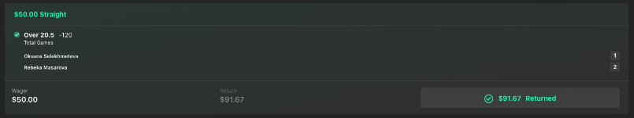
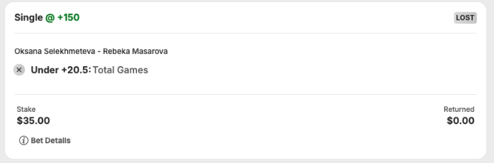
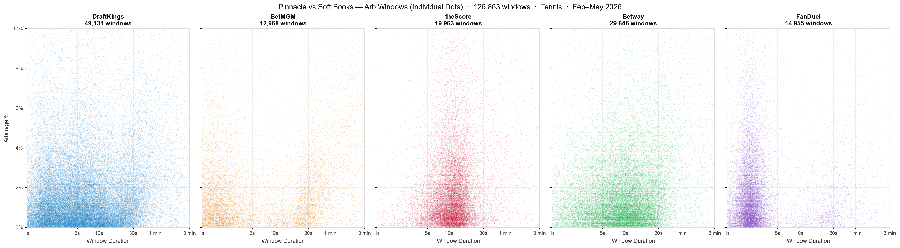
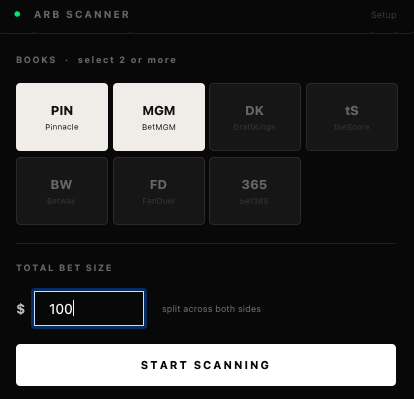
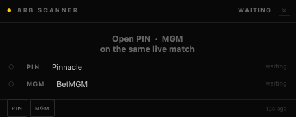
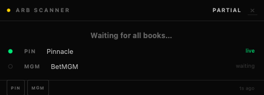
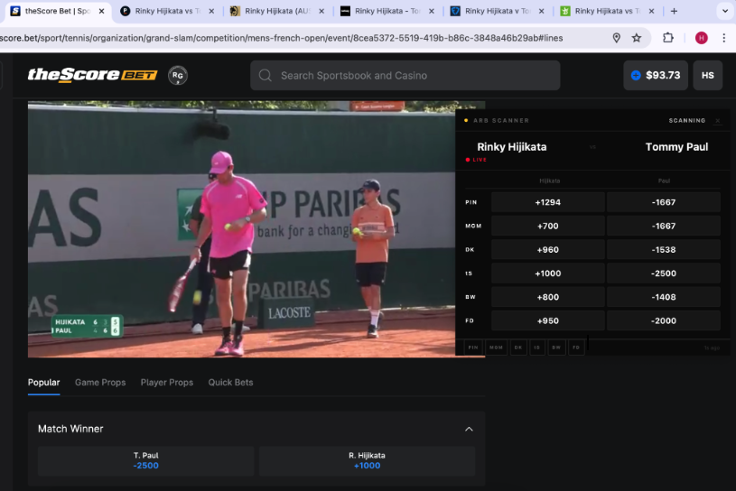
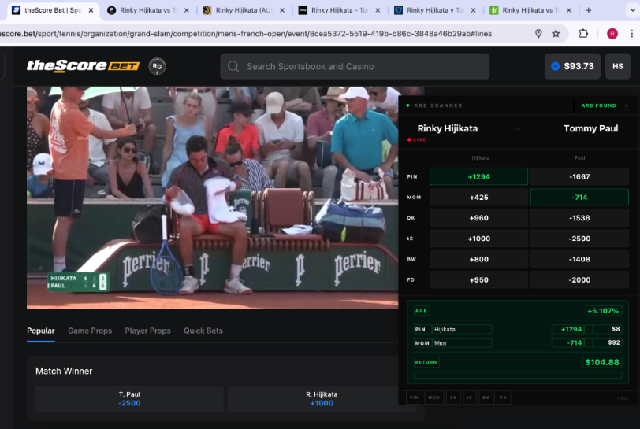

# Live Sportsbook Arbitrage (Tool + Research)

## Introduction

Sportsbooks behave like financial markets, with lines and prices constantly changing based on betting behaviour. Unlike traditional markets, most sportsbooks set their prices independently, so discrepancies between books are bound to exist.

Before games start, prices between books are similar since the market has enough time to settle around an expected value. However, during live (mid-match) betting, every sportsbook has to independently reprice its odds in real time. Some books react quickly to new information, while others are slower to adjust. These gaps create opportunities for arbitrage.

Arbitrage in sports betting is when you take advantage of a price discrepancy between two books by betting both sides of an outcome at the same time, locking in a guaranteed profit. In practice, it looks like this. One book re-prices a live line after a score update. Another book has not updated their line yet. For a brief window, the combined implied probability of both outcomes across the two books adds up to less than 100%.

---





Both bets are on the same match and same line (20.5 total games). Bet365 has the Over at -120, Betway has the Under at +150.

- -120 in American odds is 1.83 decimal, which implies about 54.5%. (1 ÷ 1.83)
- +150 is 2.50 decimal, which implies 40.0%. (1 ÷ 2.50)
- Add them together and you get 94.5%. That's a 5.5% edge.

$50 on Over at bet365. $35 on Under at Betway. $85 total. The match went over. bet365 returns $91.67, Betway loses the $35. Net: +$6.67. If it had gone Under instead, Betway pays $87.50, bet365 loses $50. Net: +$2.50.

A sportsbook normally prices both sides of a bet so that the implied probabilities add up to slightly over 100% that overage is their built-in margin (the vig). The vig is how books make money regardless of outcome. When you find two books where the combined probabilities add up to under 100%, the books have effectively handed their margin to you instead.

---

This repository consists of two parts:

**Part 1: Research:** Collected 6.5 million rows of historical odds data spanning 6 sports and 7 Ontario sportsbooks over a 3-month period. We ran a analysis to develop an optimal betting strategy (which sports, book pairs, pre vs live match, etc.)

**Part 2: Live Tool:** A real-time overlay that reads live odds directly from open browser tabs. The instant an arb window opens between two books, the tool shows you exactly how much and where to bet to guarantee a profit.

---

## Part 1: Research

### Data Collection

Data was sourced through the OddsPapi API (`https://api.oddspapi.io/v4`). OddsPapi provides a historical odds endpoint that returns every single price change a bookmaker made on a given game, with exact timestamps.

The first thing we needed was a list of every game that happened across 6 sports in the last 3 months. OddsPapi's unique identifier for one match is a fixture ID, something like `id1000000758265379`. That might represent Djokovic vs Alcaraz on April 3rd. (It is just an ID, no odds attached yet.)

The API requires date windows of 10 days or fewer, so we chunk each sport into 9-day windows and sweep the full 3-month range.

```
Sport           Fixtures collected
──────────────  ──────────────────
Soccer          52,365
Basketball      16,326
Tennis          18,244
Baseball        11,819
Ice Hockey       7,290
MMA                260
───────────────────────
Total          106,304
```

106,000 game IDs.

### Priority Filtering

106,000 games is far more than we need. Most of these are leagues and competitions that Ontario sportsbooks do not actively price.

We tagged fixtures as `priority = 1` for:

- **Soccer:** Premier League, Championship, LaLiga, Serie A, Bundesliga, Ligue 1, Champions League, Europa League, Conference League, MLS, Eredivisie, Liga Portugal, Brasileiro Serie A, Super Lig, and several other top European leagues
- **Basketball:** NBA only
- **Tennis:** All ATP and WTA Masters-level events (Monte Carlo, Madrid, Miami, Indian Wells, Rome, Roland Garros)
- **Baseball:** MLB only
- **Ice Hockey:** NHL only
- **MMA:** All UFC and PFL events

```
Priority = 1  :  5,647   (we fetch these)
```

### Pinnacle Collection

With the fixture list filtered, we fetched the complete moneyline history from Pinnacle for all 5,647 priority fixtures.

Pinnacle is a sharp book. It accepts bets from professional bettors and syndicates, never limits winning accounts, and operates with some of the lowest margins in the industry. As a result, its lines are considered the most accurate real-time reflection of true probability in the market. This makes Pinnacle the reference point. When we see Pinnacle move and a soft book has not moved yet, that is a potential arb window.

The historical endpoint returns every single price change with an exact timestamp. For one fixture it looks like this:

```
Valentova vs Birrell | WTA Dubai

  Pinnacle:
    10:15:32   Valentova  -->  1.85   (line opens)
    10:15:32   Birrell    -->  2.10
    10:47:11   Valentova  -->  1.72   (sharp money moved this)
    10:47:11   Birrell    -->  2.31
    11:03:44   Valentova  -->  1.61   (moved again)
    11:03:44   Birrell    -->  2.56
```

Every timestamp is a trigger. When Pinnacle moves, the question becomes: did the soft book follow yet? If not, how big is the gap?

Full Pinnacle collection results:

```
Total fetched  :  5,647 / 5,647
OK             :  5,534
Empty          :      2   (Pinnacle had no data for these)
Errors         :    111   (bad fixture IDs)
Total rows     :  4,612,312

Breakdown by sport:
  Soccer       -->  2,654,970 rows
  Tennis       -->    734,179 rows
  Basketball   -->    527,776 rows
  Baseball     -->    441,158 rows
  Ice Hockey   -->    233,636 rows
  MMA          -->     20,593 rows
```

4.6 million rows. Complete Pinnacle moneyline history across 6 sports, 3 months, from open to close for every priority fixture.

### Analysis

Before collecting soft book data, we first analyzed Pinnacle's own data to understand where the action is. More Pinnacle volatility means more repricing events. More repricing events means more opportunities for soft books to lag behind. This step tells us where to focus.

**Which sport moves the most?**

```
Sport           Avg Move    Avg Changes per Fixture
────────────    ─────────   ───────────────────────
Tennis           25.998              597
Soccer           21.422              987
Baseball         12.246              801
Ice Hockey        8.357              537
Basketball        7.632            1,165
MMA               2.594              107
```

Tennis has an average line move of 25.998, more than 3x basketball and ice hockey. This is intuitive once you think about the sport: tennis is one-on-one, and a single break of serve can dramatically shift match probability.

The top 14 most volatile individual tournaments are all tennis. The top 5:

```
ATP Monte Carlo, Monaco          28.694 avg move    74 fixtures
WTA Charleston, USA              28.214             39 fixtures
ATP Marrakech, Morocco           27.750             23 fixtures
WTA Linz, Austria                27.528             38 fixtures
WTA Indian Wells, USA            27.438            116 fixtures
```

**Pre-game vs in-game**


In-game Pinnacle movement is 3.8x larger per change than pre-game movement. The biggest arb windows are live, not before the match starts. This finding defined the live tool's purpose: it needs to work during matches, not just as a pre-game scanner.

### Soft Book Collection

With the tennis-focus decision made, we fetched complete moneyline history for 7 Ontario soft books across all 1,298 priority tennis fixtures.

```
Processed  : 1,298 fixtures
Total rows : 1,920,867

Book            Rows
────────────    ────────
DraftKings       835,144
BetMGM           307,561
theScore         280,102
Betway           253,710
FanDuel          230,320
bet365            14,030
888sport.ca            0   (no tennis coverage)
```

```
Pinnacle      734,179 rows
Soft books  1,920,867 rows
────────────────────────────
Total       2,655,046 rows of tennis moneyline data
```

2.65 million timestamped price changes across 7 books and 1,298 tennis matches. This is the dataset we run the arb analysis on.

### Arb Analysis

The arb analysis script takes the full dataset and answers one question for every moment in time across every fixture: could you have placed two bets right now and been guaranteed a profit?

The process for each fixture:

1. Load the complete Pinnacle price timeline and the soft book price timeline
2. At every timestamp where either book changed their price, snapshot what both books were simultaneously offering
3. Compute the arb margin in both directions:
   - Bet side A on Pinnacle + side B on soft book
   - Bet side B on Pinnacle + side A on soft book
4. If the margin is positive, an arb window is open, start timing
5. When the margin drops back to zero or below, record the window: duration, peak margin, tournament, timestamp
6. Aggregate all windows by book pair, tournament, and hour of day

```
arb_margin = 1 - (1 / pinnacle_price_side_A + 1 / softbook_price_side_B)

Positive margin = guaranteed profit exists
```

**Pinnacle vs each soft book:**

```
Book          Windows    Freq%    Avg Margin   Avg Duration
───────────   ───────    ─────    ──────────   ────────────
DraftKings     55,119   15.35%      2.239%          22.8s
BetMGM         19,613   28.91%      3.387%         104.4s
theScore       21,039   10.80%      2.358%          23.7s
Betway         32,364   14.80%      2.309%          23.1s
FanDuel        16,240    9.61%      2.137%          11.9s
bet365          6,974   68.48%      5.691%         609.2s
```



**bet365's numbers are misleading.** 68% frequency and nearly 6% average margin sounds like the best pair by a wide margin. But look at the 609-second average window. That is ten minutes. bet365's 14,030 rows vs DraftKings' 835,144 rows tells the real story: bet365 barely participates in live tennis pricing. Their lines are effectively static during a match. The "arb" is just a permanently stale number sitting there (betting locked).

**BetMGM is the primary target.** 28.91% of all price snapshots had an arb window open. Average margin of 3.387%. And the most important number: 104 seconds average window duration.

**Best tournaments:**

The same tournaments that showed the highest Pinnacle volatility also showed the most arb windows. The signal is consistent across both analyses:

```
WTA Rome         -->  highest single-book window count (16,167 vs DraftKings alone)
ATP Madrid       -->  second highest overall
WTA Madrid       -->  third
ATP Indian Wells -->  highest avg margin vs BetMGM (17.7%)
ATP Miami        -->  consistently top 3 across all books
```

**The strategy in practice:**

Based on everything the data showed:

- **Sport:** Tennis only. The volatility advantage over every other sport is significant.
- **Primary pair:** Pinnacle vs BetMGM. Longest windows, easiest to manually execute.
- **Secondary pair:** Pinnacle vs DraftKings. Most volume, requires faster execution.
- **Tournaments to prioritize:** Rome, Madrid, Miami, Indian Wells. These show up at the top across every analysis.
- **Best hours:** 19:00-22:00 UTC for BetMGM. 10:00-18:00 UTC for DraftKings.
- **In-game only:** Pre-game arb exists but is small (avg 2.03 move per change vs 7.81 late in-game). The real edge is live.

---

## Key Numbers

| Metric                               | Value                                       |
| ------------------------------------ | ------------------------------------------- |
| Fixture IDs collected                | 106,304                                     |
| Priority fixtures processed          | 5,647                                       |
| Pinnacle rows collected              | 4,612,312                                   |
| Soft book tennis rows collected      | 1,920,867                                   |
| Total dataset size                   | 6,532,179 rows                              |
| Database size (combined)             | ~1.77 GB                                    |
| Tennis fixtures fully analyzed       | 1,262                                       |
| Total arb windows identified         | ~151,000+                                   |
| Best pair by window duration         | Pinnacle vs BetMGM (104s avg)               |
| Best pair by volume                  | Pinnacle vs DraftKings (55,119 windows)     |
| In-game vs pre-game volatility ratio | 3.8x larger in-game                         |
| Recommended focus                    | Tennis, Pinnacle vs BetMGM, 19:00-22:00 UTC |

---

## Part 2: Live Tool

The live tool is a small overlay that tells the user when an arbitrage opportunity appears across the sportsbooks they have open in their browser.

Similar tools like OddsJam inform users of arbitrage opportunities. However, these tools pull their data from an odds aggregation API, not directly from the books. This latency cuts down the user's time to place the bet, and at times causes them to miss the arb altogether. In practice, sitting on OddsJam with a book open side by side, you can see the book's price move on screen while OddsJam is still showing the old number. By the time OddsJam flags the arb, the book has already caught up and the window is gone.

Our tool avoids this by reading directly from the browser tabs. There is no API in between. When the book's frontend updates a price element on screen, our extension reads it.

### How the Tool Works

The tool has three layers that work together.

**Layer 1: Chrome Extension**

A Chrome extension is loaded into your browser in Developer Mode. It does two things depending on the book:

For Pinnacle and BetMGM, it hooks directly into the page's network activity in the MAIN world (same execution context as the page itself). It intercepts Pinnacle's REST API responses for matchup data and odds, and intercepts BetMGM's SignalR WebSocket frames as they come through. This means we get the price the exact moment the book's own frontend receives it.

For the other books (DraftKings, theScore, Betway, FanDuel, bet365), it injects a DOM monitor that uses MutationObserver to watch the page for any changes. The instant the book's React or Vue frontend patches a price element, the observer fires and the extension reads the new value. The monitor also has a 3-second polling fallback and a 2-second heartbeat that re-broadcasts the last known price so the Python server can auto-attach within 2 seconds of startup.

Because Chrome's Manifest V3 enforces strict isolation between the page context and the extension context, the architecture uses relay scripts to bridge messages across worlds:

```
MAIN world (can read page JS and intercept network):
  betmgm.js          - hooks BetMGM WebSocket + fetch
  pinnacle.js        - hooks Pinnacle REST API responses
  background.js      - injects DOM monitors for all other books

ISOLATED world (can use chrome.* APIs):
  relay.js           - bridges BetMGM messages to service worker
  pinnacle_relay.js  - bridges Pinnacle messages to service worker
  soft_relay.js      - bridges all other books to service worker
```

**Layer 2: Python Server**

A lightweight http server runs on `localhost:8765`. The extension posts every price update to it. The server:

1. Stores incoming data in a per-book cache keyed by fixture ID
2. Matches fixtures across books using surname-based name matching (handles `"J. Alcaraz"` vs `"Carlos Alcaraz"` and compound surnames)
3. Checks all pairs of selected books for arb at every update
4. Emits signals to the GUI: `waiting`, `partial`, `scanning`, or `arb_found`

**Layer 3: PyQt5 Overlay**

A frameless, always-on-top window that sits on the screen.

On startup, a setup dialog appears. Select which books you want to monitor and set your total stake:



Four states:

**WAITING**: No books detected yet.



**PARTIAL:** Some books detected, waiting for others.



**SCANNING:** All books matched on the same fixture, no arb currently.



**ARB FOUND:** Arb is open. Shows which book, which side, exact stake, margin %.



### Setup and Usage

**Install Python dependencies:**

```bash
cd arb-gui
pip install -r requirements.txt
```

**Load the Chrome extension:**

1. Open Chrome and go to `chrome://extensions`
2. Enable Developer Mode (top right toggle)
3. Click Load Unpacked and select the `arb-gui/extension/` folder

**Run the tool:**

```bash
python main.py
```

Or on macOS:

```bash
chmod +x launch_mac.sh
./launch_mac.sh
```

A setup dialog will appear. Select which books you want to monitor (any 2 or more) and set your total stake. Hit Start Scanning.

Open the matching event page for the same match on each selected book in Chrome. The overlay auto-detects each tab within 2 seconds and transitions through its states automatically. If any books are not attached to the GUI, hard refresh the particular book.

### Supported Books

| Book       | How it reads                                                |
| ---------- | ----------------------------------------------------------- |
| Pinnacle   | Intercepts REST API matchup and odds responses              |
| BetMGM     | Intercepts SignalR WebSocket frames + DOM backup            |
| DraftKings | DOM monitor: scans for Moneyline section, reads buttons     |
| theScore   | DOM monitor                                                 |
| Betway     | DOM monitor: leaf node scan for names and prices separately |
| FanDuel    | DOM monitor: reads `aria-label` attributes                  |
| bet365     | DOM monitor: reads `gl-Market` class elements               |

---

## Note

**Account limitations.** A consistently profitable arb bettor will eventually be limited by sportsbooks. Once limited, meaning your maximum bet is reduced to something like $5, you can no longer place stakes large enough to make windows worthwhile. Getting limited is inevitable.

**Bet sizing.** It's optimal to place bets in rounded amounts. Placing a bet for an exact calculated amount like $124.23 signals to a sportsbook's risk system that you are betting to a specific formula rather than recreationally. Books use stake precision as one of many signals to identify and flag sharp bettors. Rounding to the nearest dollar looks more natural. The tool rounds your stakes automatically.
